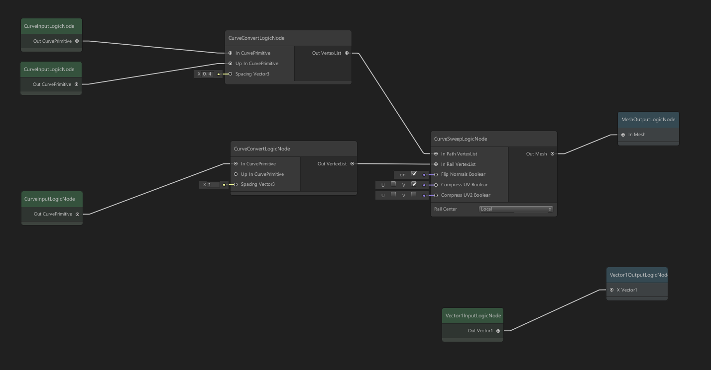

# GTLogicGraph



The intent of this project is to provide a generic graph view based on the new GraphView and VisualElements system found in Unity 2018, the same systems which the new ShaderGraph are based off of.

It should be noted that this codebase is HEAVILY based off of the ShaderGraph source code. Many sections of it are directly copied with minimal editing. I did exhaustively try to make this an extension that rests on top of the ShaderGraph source code. But unfortunately the ShaderGraph source is far too intertwined with the being a material node system rather than a generic node system. So my methodology has been to retain as much code and pattern from the ShaderGraph source as is ideal, while editing it enable a generic graphic system. Theoretically the ShaderGraph system be reimplemented to use this as basis.

Completed or Started:
- Can drag graph around.
- Can zoom in/out of graph.
- Can drag nodes around.
- Can drag a box to multi select nodes and drag multiple nodes.
- Can drag line off of node.
- Can chain together nodes.
- Can open search menu to add nodes.
- Serializing and save of graphs.
- Graphs can be loaded into scene via LogicGraphInstance component.

Still to do:
- Implement more common base types and nodes.
- Copy and paste nodes.
- Implement input views.
- Implement blackboards.

## Installation

This repo is intended to cloned as a submodule into a unity project.
```
git submodule add https://github.com/rygo6/GTLogicGraph.git Assets/GeoTetra/GTLogicGraph
```
